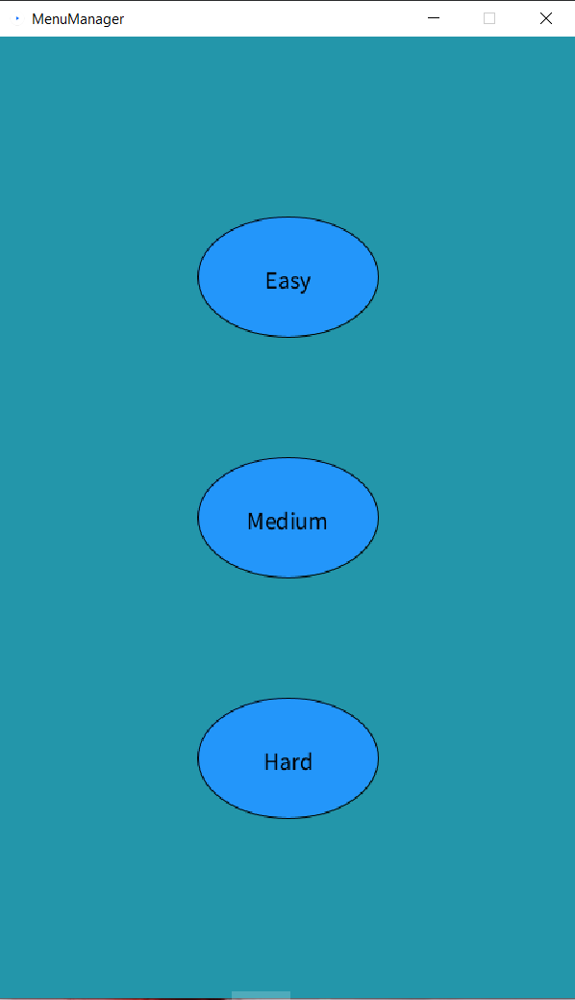
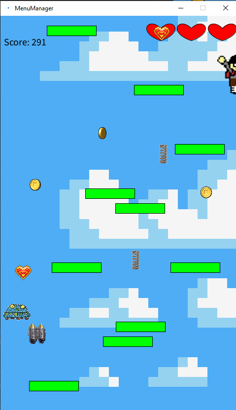
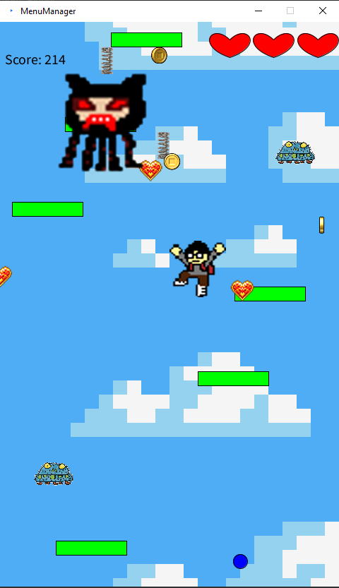

## Contributions
Ravdeep Aulakh - Enemy, EnemyManager, Boss, BossManager, Platform\
Brian Kwon - Game, MenuManager, StartMenu, MainMenu, LeaderboardsMenu, DifficultyMenu, PauseMenu, DeathMenu, SubmitMenu, Button\
Shawn Birring - \
Maximillian Yong - \
Hyuk Park - 

## How to Start Game
In order to start a new game select the *<b>"Main"</b>* \
class and run it. A window similar to this will pop up:

From this menu you want to press on the space bar to continue
after which you will be greeted with this menu:

On this menu you want to select *<b>"Start Game"</b>*.
After you select that you should be greeted with this menu:

Here you want to select the difficulty you want to play on.

## How to Play the Game
### Basics
You can move left and right using <b>*A*</b> and
<b>*D*</b> keys, or you can also use the <b>*Right*</b>
and <b>*Left*</b> arrow keys. The player will automatically
jump when he hits a platform. To shoot projectiles you
can press <b>*Space Bar*</b> and they will be shot straight up
from your current position. You start off with 3 lives
and lose 1 life everytime you die until you have 0 lives
left at which point the game will end. Finally, your score 
is displayed in the top left corner of the game.

### Platforms
The game will generate *<b>green</b>* and *<b>red</b>* 
platforms which you the player can jump off of. These
platforms will move down the screen until they fall off.
The green platforms are normal and will let you 
jump off of them as many times as you want whereas 
the red one's will break after one jump.

### Enemies
The game also contains enemies. Enemies will spawn in
randomly and at random locations in the game. They
move down at the same speed as platforms and can be
killed by hitting them with projectiles. But beware
as colliding with enemies will take a life from you.

### Boss
There is a boss in the game that will appear once
per game. He spawns at score 3000. The boss takes
3 hits from the players projectiles to kill. The boss
spawns at the top of the window and moves left and right
while shooting projectiles down at the player. Colliding
with either the boss or his projectiles will cause you
to lose a life.

### Power Ups
The game also has power ups. There are 3 different types
of power ups. The first is the spring landing on it will
jump you up similar to a platform. The second is the
jetpack landing on it will boost you up a little higher
than a platform would. The final power up is the heart,
landing on it will give you another life as long as you
have less than 3 hearts.

### Coins
The player can collect coins as well throughout
the game which will increase they're overall score.
The coins are the spinning gold coins and appear
randomly throughout the window.
